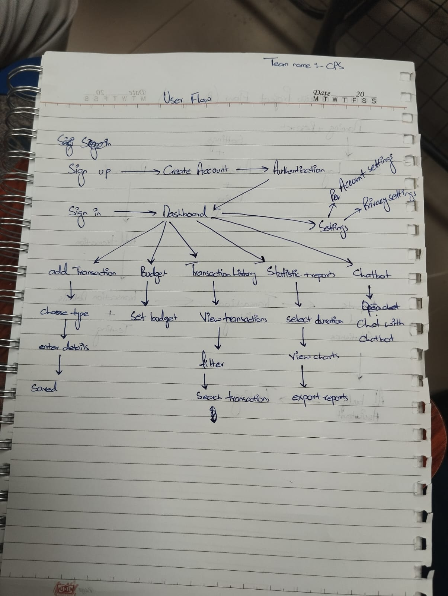
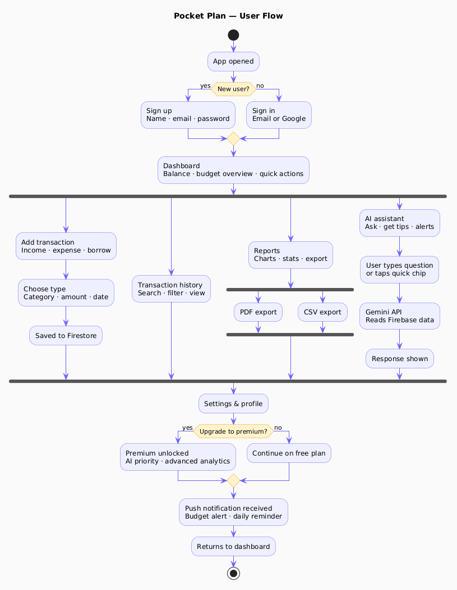

# User & Development Flow

**Pocket Plan — User & Development Flow Diagrams**  
Team CPS · Sprint 0 · v1.0

---

## 1. In-Class Flow Diagram

Hand-drawn flow diagram showing the user journey through the Pocket Plan app — from authentication through core features.

---

## 2. PlantUML Flow Diagram

Formal UML flow diagram generated using PlantUML, showing the full user and system interaction flow.

---

*Pocket Plan · User & Development Flow · Team CPS · Sprint 0 · v1.0*
