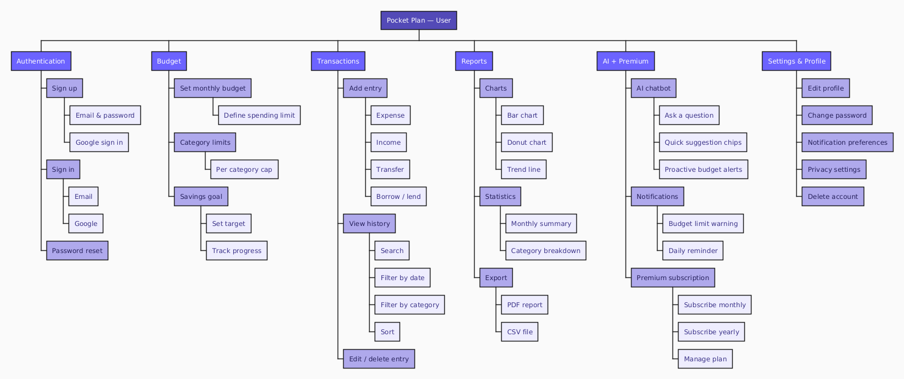
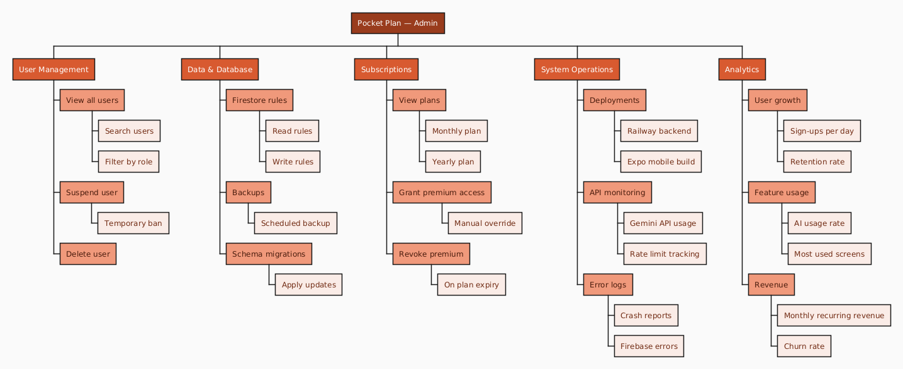

# Work Breakdown Structure (WBS)

**Pocket Plan — Work Breakdown Structure**  
Team CPS · Sprint 0 · v1.0

---

## 1. User WBS

Feature breakdown from the **User** perspective — all tasks and sub-tasks related to user-facing functionality across the 5 project phases (Initiation → Planning → Execution → Control → Closure).

---

## 2. Admin WBS

Feature breakdown from the **Admin** perspective — all tasks and sub-tasks related to backend dashboard, user management, subscriptions, and system administration.

---

*Pocket Plan · Work Breakdown Structure · Team CPS · Sprint 0 · v1.0*
